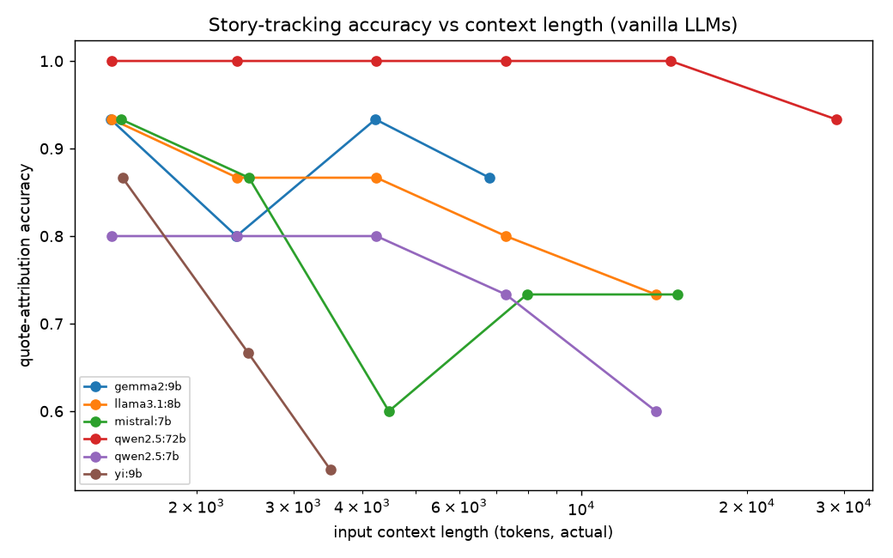

# Vanilla-LLM Narrative-Coherence Failure Profile

*Foundational evaluation for the long-form-coherence project — establishes the
measurement pipeline and the baseline failure signal that the main study builds
on.*

**Question.** How badly do off-the-shelf open-source LLMs lose narrative
coherence with **no memory engine** helping them? We profile 10 models on four
literary-NLP probes and roll the errors into three failure rates, giving a
per-model "failure profile."

**Setup.** Orchestration, metrics, Neo4j, and datasets run locally; **inference
runs on Google Colab** (Ollama + cloudflared tunnel — T4 for ≤9B models, A100 for
the 72B). Every call uses a free local open model — **zero API cost**.

**Two parts.** **Part 1** profiles 10 models at a single fixed context length.
**Part 2** re-runs 6 of them up a **context-length ladder** to find each model's
*failure point* — how many input tokens it can take in and still track the story —
reusing the same four metrics so the two parts are directly comparable.

---

## TL;DR

- **No model ≤9B is both accurate and well-calibrated.** Only 3 of 10 —
  `qwen2.5:72b`, `gemma2:9b`, `qwen2.5:7b` — catch contradictions *without*
  rejecting valid text.
- **The contradiction rate is gameable on its own.** Three models score a
  "perfect" 0.000 by flagging *everything* as a contradiction; you only see this
  by pairing it with an **over-flag rate** (our addition to the metric set).
- **Scaling fixes capability, but calibration is a family trait** — Qwen and
  Gemma improve with size; Llama stays trigger-happy at both 3B and 8B.
- **Entity drift does not track model size** — an 8B leads and a 3B of the same
  family trails; a 2B beats most 7-9B models.
- **Advertised context windows are 3–18× larger than the usable ones (Part 2).**
  Mid-size models still track the story to only ~1.5K–7K tokens despite 32K–128K
  advertised windows; the 72B is the only one that holds accuracy deep into
  context. Capacity, not the advertised number, sets the real limit.

---

## 1. What was measured

| Task | Dataset | Question it asks | Gold source |
|---|---|---|---|
| Quote attribution | PDNC — *Pride & Prejudice* | "who said this line?" | PDNC speaker labels |
| Name cloze | GPT4-Books — P&P, Moby Dick, Emma | recall a masked character name | original text |
| Coreference | LitBank — Great Expectations, Tom Sawyer, Of Human Bondage | are two mentions the same person? | LitBank coref chains |
| Consistency | synthetic tiered stress set | detect planted contradictions | authored labels |

Per model: **100** quotes, **300** cloze passages, **136** coreference pairs, and
**24** consistency cases — 14 planted contradictions across three difficulty
tiers (blatant / moderate / subtle) plus **10 clean "bait" controls** that look
suspicious but are consistent (e.g. a character visits another's location and
returns; an illiterate character asks someone to read aloud). The baits are what
let us measure over-flagging.

---

## 2. Results — the failure profile (10 models)

Ordered by quote-attribution accuracy (a clean proxy for overall capability).
For the three **failure rates**, higher = worse.

| model | quote | cloze | coref | cons_recall | over_flag | contradiction | location | entity_drift |
|---|---|---|---|---|---|---|---|---|
| **qwen2.5:72b** | **0.742** | **0.190** | 0.713 | 0.857 | 0.50 | 0.143 | 0.167 | 0.287 |
| gemma2:9b | 0.619 | 0.070 | 0.699 | 0.929 | 0.50 | 0.071 | 0.000 | 0.301 |
| llama3.1:8b | 0.577 | 0.077 | 0.772 | 1.000 | 1.00 | 0.000 | 0.000 | **0.228** |
| qwen2.5:7b | 0.474 | 0.053 | 0.691 | 0.786 | 0.50 | 0.214 | 0.167 | 0.309 |
| mistral:7b | 0.392 | 0.107 | 0.640 | 0.214 | 0.10 | 0.786 | 0.667 | 0.360 |
| llama3.2:3b | 0.299 | 0.047 | 0.449 | 1.000 | 1.00 | 0.000 | 0.000 | **0.551** |
| qwen2.5:3b | 0.278 | 0.003 | 0.647 | 0.143 | 0.00 | 0.857 | 1.000 | 0.353 |
| phi3.5 (3.8B) | 0.268 | 0.003 | 0.713 | 0.929 | 0.80 | 0.071 | 0.000 | 0.287 |
| yi:9b | 0.268 | 0.017 | 0.699 | 0.929 | 1.00 | 0.071 | 0.000 | 0.301 |
| gemma2:2b | 0.206 | 0.007 | 0.728 | 0.643 | 1.00 | 0.357 | 0.667 | 0.272 |

**Metric definitions**

- **quote** — quote-attribution accuracy: fraction of dialogue lines whose
  speaker the model names correctly.
- **cloze** — name-cloze accuracy: fraction of masked character names the model
  recalls exactly.
- **coref** — coreference accuracy: fraction of mention pairs correctly judged as
  the same vs a different character.
- **cons_recall** — consistency recall: fraction of planted contradictions the
  model flags.
- **over_flag** — over-flag rate: fraction of *clean* (consistent) drafts the
  model wrongly flags as contradictions. High = it rejects valid text.
- **contradiction** — contradiction rate = 1 − cons_recall: share of planted
  contradictions the model **misses**.
- **location** — location-inconsistency rate: the contradiction rate restricted
  to place/location contradictions (character in the wrong place, two places at
  once).
- **entity_drift** — entity-drift rate = 1 − coref accuracy: how often the model
  loses a character's identity — **splitting** one person into two or **merging**
  two people into one.

---

## 3. Findings

**1. Calibration is the dominant failure mode — and the contradiction rate is
meaningless without its precision counterpart.** A model that labels *every*
draft a contradiction scores a perfect contradiction rate (0.000) while being
useless. `llama3.1:8b`, `llama3.2:3b`, and `yi:9b` all read `contradiction=0.000`
— but `over_flag=1.00` shows they reject **all 10 clean drafts** too. At the
other extreme, `qwen2.5:3b` and `mistral:7b` approve almost everything
(contradiction 0.86 / 0.79). Only **three models are usable validators** —
contradiction caught *and* over-flag ≤ 0.5: **qwen2.5:72b, gemma2:9b, qwen2.5:7b.**
→ *Methodological takeaway: the proposed contradiction/location rates must be
reported alongside an over-flag (false-positive) rate, or a "flag-everything"
model looks perfect.*

**2. Scaling fixes capability; calibration is a family trait.**
- **Qwen** improves both with size: 3B approves everything (recall 0.14) → 7B and
  72B become balanced (recall 0.79 / 0.86, over-flag 0.50).
- **Llama** scales capability (quote 0.30 → 0.58 from 3B→8B) but stays
  trigger-happy at **both** sizes (over-flag 1.00) — scale did not fix calibration.
- **Gemma** 2B is unreliable; 9B is the best-calibrated model under 70B.

**3. Entity drift does not track model size.** Best = `llama3.1:8b` (0.228);
worst = `llama3.2:3b` (0.551) — same family, opposite ends. `gemma2:2b` (2B,
0.272) beats most 7-9B models. Identity tracking is an architecture/training
property, not a parameter-count one.

**4. The difficulty tiers work as intended.** For capable models the recall
gradient is clean — e.g. `qwen2.5:7b` catches blatant 1.00 → moderate 0.83 →
subtle 0.60 — so the *subtle* cases are what separate models. For rubber-stamp
models the gradient collapses (they catch ~everything or ~nothing regardless of
tier), which is itself the signal that they aren't reasoning about the canon.

**5. Name recall is hard for all; explicit attribution is a large-model skill.**
Cloze tops out at **0.190 (72B)** — the only model to beat ChatGPT's stored
answers on the same passages (0.153); every model ≤9B is below 0.11. Likewise,
overall quote accuracy scales smoothly, but the *explicit-speaker* sub-score is
~0 for every model except the 72B (0.565).

**Bottom line for the project.** The relational/identity tasks — quote
attribution, coreference, consistency — are exactly where vanilla models fail
most, and exactly what a knowledge graph answers deterministically. That gap is
the case for the memory engine.

---

## Part 2 — Context-length failure points

Part 1 tested every model at one fixed, small context (Ollama's ~2K default cap).
Part 2 re-runs 6 of them (well-calibrated first) up a context-length ladder,
lifting that cap — each of the four Part-1
metrics scored at every length, with Ollama's `num_ctx` set so nothing is silently
truncated and the x-axis the real token count processed (`prompt_eval_count`). All
numbers are copied from the machine-generated
[context_summary.md](evals/results/context/context_summary.md).

### 1. Advertised window vs failure point

The **failure point** = the largest input length at which a model is still within
20% of its own peak — how far it reads before accuracy drops and stays down.

| model | params | advertised window | quote-attribution failure point | vs advertised |
|---|---|---|---|---|
| yi 1.5 9B | 9B | 4,096 | ~1,468 | **2.8× smaller** |
| mistral 7B | 7B | 32,768 | ~2,491 | **13× smaller** |
| qwen2.5 7B | 7B | 131,072 | ~7,292 | **18× smaller** |
| llama 3.1 8B | 8B | 131,072 | ~7,293 | **18× smaller** |
| gemma2 9B | 9B | 8,192 | ≥6,810 (held to its window) | — |
| qwen2.5 72B | 72B | 131,072 | ≥29,023 (held; not reached) | — |

`≥N` = accuracy never dropped that far in the range the GPU could run.



### 2. Each metric by context window

Value at each context window (rows = models by advertised window; "—" = beyond the
model's window; exact per-length and per-depth numbers in `context_summary.md`):

**Quote attribution (overall accuracy)**

| model | 1K | 2K | 4K | 8K | 16K |
|---|---|---|---|---|---|
| yi 1.5 9B | 0.87 | 0.67 | 0.53 | — | — |
| gemma2 9B | 0.93 | 0.80 | 0.93 | 0.87 | — |
| mistral 7B | 0.93 | 0.87 | 0.60 | 0.73 | 0.73 |
| qwen2.5 7B | 0.80 | 0.80 | 0.80 | 0.73 | 0.60 |
| llama 3.1 8B | 0.93 | 0.87 | 0.87 | 0.80 | 0.73 |
| qwen2.5 72B | 1.00 | 1.00 | 1.00 | 1.00 | 1.00 |

**Coreference (accuracy)**

| model | 1K | 2K | 4K | 8K | 16K |
|---|---|---|---|---|---|
| yi 1.5 9B | 0.57 | 0.57 | 0.64 | — | — |
| gemma2 9B | 0.79 | 0.86 | 0.71 | 0.71 | — |
| mistral 7B | 1.00 | 0.93 | 0.93 | 0.93 | 0.64 |
| qwen2.5 7B | 0.71 | 0.79 | 0.79 | 0.79 | 0.71 |
| llama 3.1 8B | 0.71 | 0.71 | 0.64 | 0.57 | 0.57 |
| qwen2.5 72B | 0.93 | 0.93 | 0.93 | 0.93 | 0.93 |

**Name cloze (accuracy)**

| model | 1K | 2K | 4K | 8K | 16K |
|---|---|---|---|---|---|
| yi 1.5 9B | 0.00 | 0.00 | 0.00 | — | — |
| gemma2 9B | 0.00 | 0.00 | 0.00 | 0.07 | — |
| mistral 7B | 0.07 | 0.00 | 0.07 | 0.13 | 0.07 |
| qwen2.5 7B | 0.13 | 0.07 | 0.07 | 0.07 | 0.00 |
| llama 3.1 8B | 0.00 | 0.00 | 0.00 | 0.00 | 0.00 |
| qwen2.5 72B | 0.13 | 0.20 | 0.20 | 0.20 | 0.27 |

**Consistency needle — detection recall / over-flag** (averaged over the 3 depths)

| model | 1K | 2K | 4K | 8K | 16K |
|---|---|---|---|---|---|
| yi 1.5 9B | 1.00/1.00 | 1.00/1.00 | 1.00/1.00 | — | — |
| gemma2 9B | 1.00/1.00 | 1.00/1.00 | 1.00/0.92 | 0.33/0.00 | — |
| mistral 7B | 0.92/0.42 | 0.83/0.25 | 1.00/0.67 | 1.00/0.75 | 0.67/0.17 |
| qwen2.5 7B | 1.00/1.00 | 1.00/1.00 | 1.00/0.92 | 1.00/1.00 | 1.00/1.00 |
| llama 3.1 8B | 1.00/1.00 | 1.00/1.00 | 1.00/1.00 | 1.00/1.00 | 1.00/1.00 |
| qwen2.5 72B | 1.00/0.83 | 1.00/0.75 | 1.00/0.75 | 1.00/0.75 | 1.00/0.92 |

**Location-inconsistency needle — detection recall / over-flag** (avg over depths)

| model | 1K | 2K | 4K | 8K | 16K |
|---|---|---|---|---|---|
| yi 1.5 9B | 1.00/1.00 | 1.00/0.92 | 1.00/1.00 | — | — |
| gemma2 9B | 1.00/0.75 | 1.00/0.75 | 1.00/0.50 | 0.17/0.08 | — |
| mistral 7B | 1.00/0.83 | 0.92/0.83 | 0.92/0.92 | 1.00/0.92 | 1.00/0.58 |
| qwen2.5 7B | 1.00/0.83 | 1.00/0.75 | 1.00/0.83 | 1.00/1.00 | 1.00/0.92 |
| llama 3.1 8B | 1.00/1.00 | 1.00/1.00 | 1.00/0.92 | 1.00/1.00 | 1.00/1.00 |
| qwen2.5 72B | 1.00/0.67 | 1.00/0.75 | 1.00/0.58 | 1.00/0.50 | 1.00/0.58 |

The 72B's quote curve was pushed to ~29K (0.93) — that point is in the failure-point
table + plot above, beyond this 16K grid.

### 3. What Part 2 shows

- **Advertised ≠ usable.** The failure point is **3–18× below** the advertised
  window for the mid-size models; even a 128K-window 7–8B model loses the thread by
  ~7K tokens.
- **Capacity buys stability across length.** The 72B holds quote (1.00→0.93),
  coref (0.93 flat) and cloze (~0.20 flat) out to 20–30K, while the 7–9B models
  drift down as context grows (mistral coref 1.00→0.64, llama 0.71→0.57). It is the
  parameter count, not the advertised number, that sets the real window.
- **Name recall is a capability floor, not a length effect.** Every sub-72B model
  scores ~0 on cloze at *every* length (matching their Part-1 floor of 0.02–0.11);
  only the 72B has real recall (~0.20), and it stays flat — so there is no cloze
  "failure point" to find for the small models.
- **The judge stays uncalibrated at every length.** On both the consistency and
  location needles the models flag everything or, as context grows, flag nothing —
  the same Part-1 calibration failure, now shown to persist across length. This is
  the direct argument for the deterministic Tier-1 gate.

*Honest read:* a discriminative **proxy** for coherence (attribution / recall /
contradiction detection), not a count of hallucinations in generated prose; and
coref/cloze use a smaller single-doc sample than Part 1, so their absolute levels
differ slightly — the length **trend** is the point.

---

## 4. Scope & next steps

This is a first, deliberately-bounded pass whose main products are (a) a working,
extensible measurement pipeline and (b) a clear baseline signal. Natural
extensions for the main study:

- **Scale n and coverage.** Sizes are set per run by flag; increasing
  quotes/cloze/coref counts and adding novels tightens confidence intervals and
  lets small gaps be read as real.
- **Broaden the consistency stimulus.** The synthetic canon is used because no
  public corpus ships planted contradictions; adding more canons and text-derived
  perturbations would generalize the calibration finding.
- **Deeper coreference.** The pairwise probe is fast and model-agnostic; full
  CoNLL cluster scoring (MUC/B³/CEAF) would give standard, comparable coref
  numbers.
- **Control quantization.** Numbers reflect these specific Ollama builds; a scaled
  study should fix precision/quantization across models.

---

## 5. Reproduce

```bash
make up && make ingest ARGS="pdnc PrideAndPrejudice"   # Neo4j + PDNC (quote task)
# per model, with a Colab Ollama tunnel URL in OLLAMA_BASE_URL:
docker compose exec -e LLM_MODE=ollama -e OLLAMA_BASE_URL=<url> \
    api python evals/run_model_profile.py --model <ollama_tag>     # Part 1
python evals/aggregate_profiles.py    # -> evals/results/failure_profile.md + .csv

# Part 2 — context-length sweep (one model at a time; reuses cached quote+needle):
docker compose exec -e LLM_MODE=ollama -e OLLAMA_BASE_URL=<url> \
    api python evals/run_context_experiment.py --model <ollama_tag> \
      --max-length 16000 --items-per-length 15   # 32000 on an A100 for the 72B
python evals/plot_context_curves.py   # -> evals/results/context/context_summary.md + plots
```

Per-model results: `evals/results/profiles/*.json` (Part 1),
`evals/results/context/*.json` (Part 2). Methodology and design decisions:
`DECISIONS.md` (sections "Failure-profile v2", "Pass 2 — LitBank coreference", and
"Context-length failure-point experiment").
