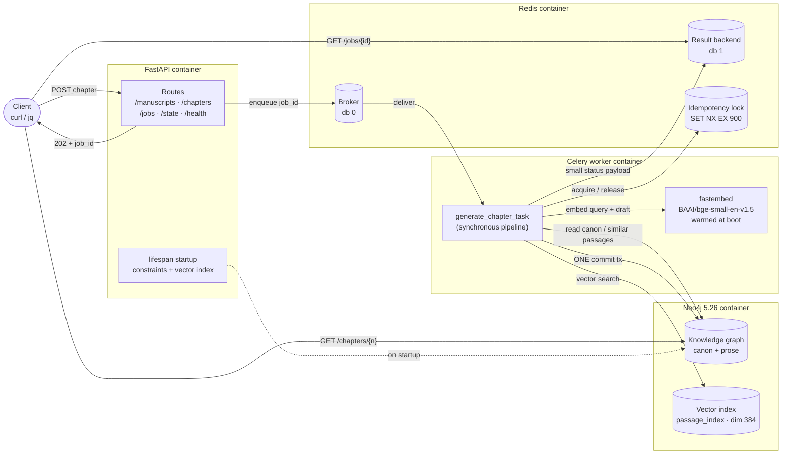
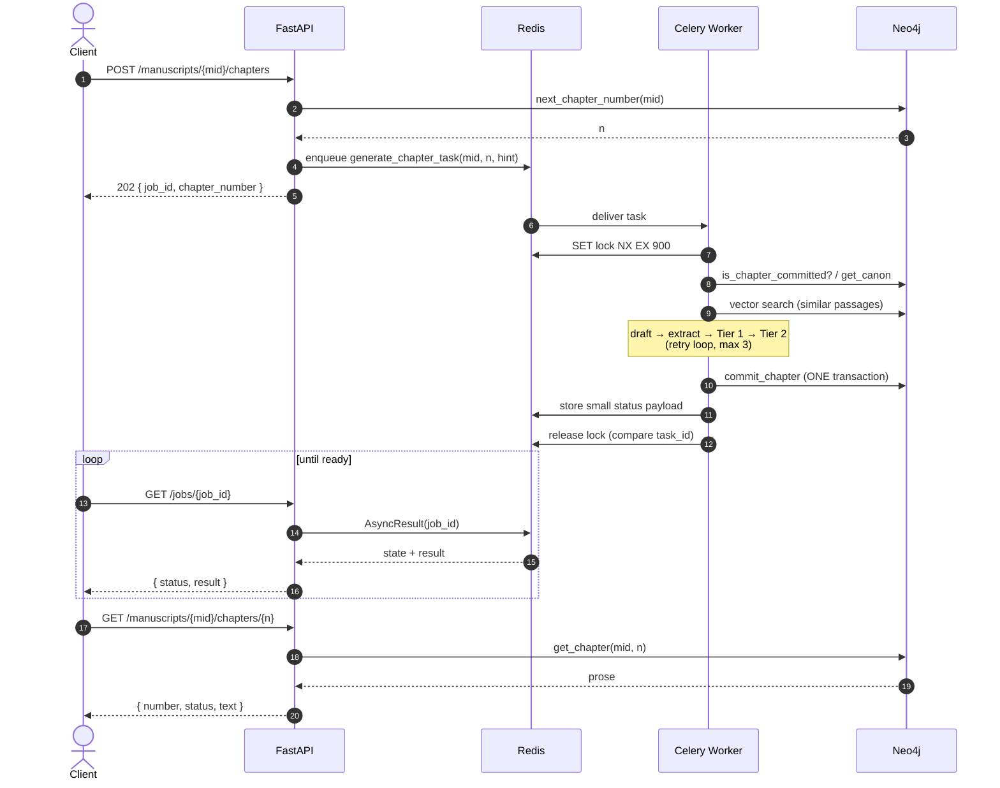
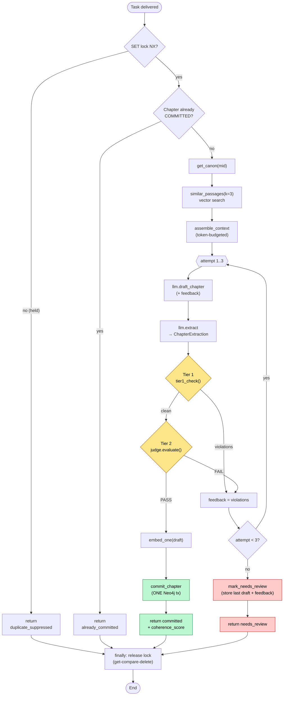
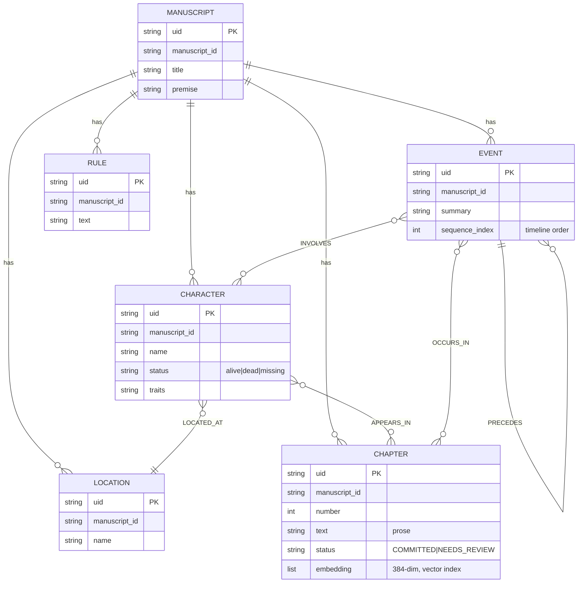
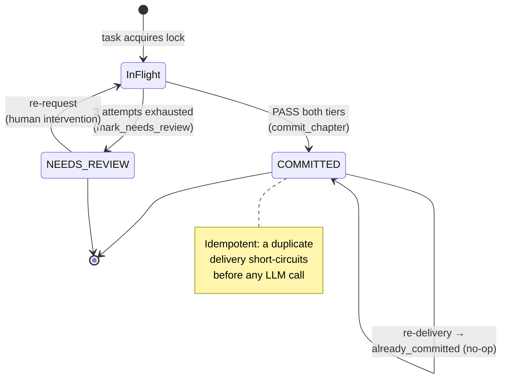
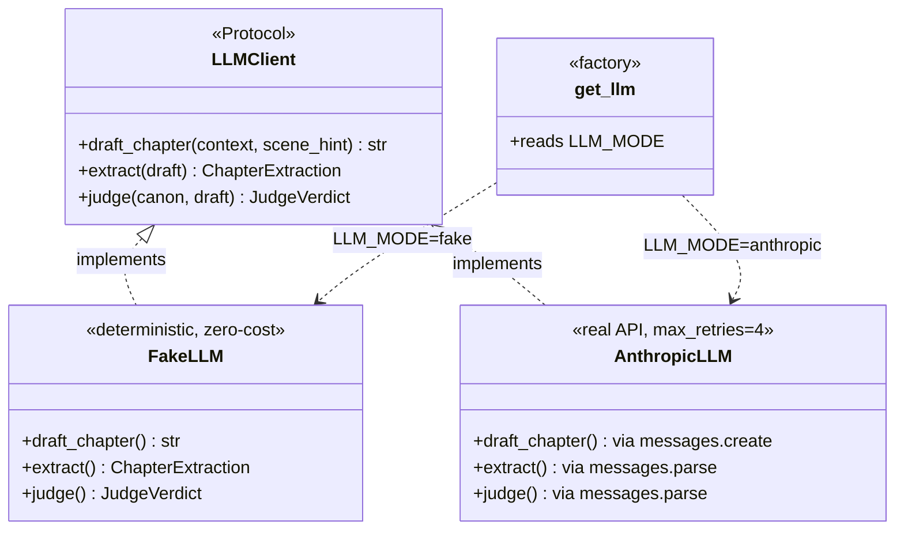
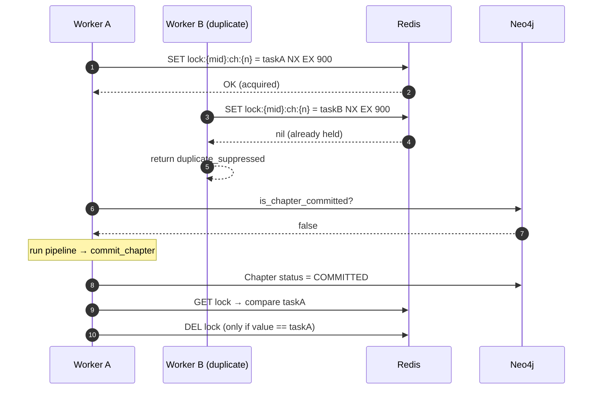

# Manuscript Memory Engine

A backend that keeps an LLM-generated fiction manuscript **narratively coherent across hundreds of chapters**. An LLM cannot hold a 300-page novel in its context window, so left alone it forgets and contradicts itself — a character who died in Chapter 2 reappears in Chapter 40. This system prevents that with three cooperating mechanisms:

1. **A Neo4j knowledge graph** — the single source of truth for canon: characters, locations, events, world rules, and the order events happened in.
2. **Hybrid retrieval per chapter** — structured facts from the graph *plus* semantically similar past passages from a vector index, merged under an explicit token budget.
3. **A two-tier validation gate** before any write — free deterministic Cypher checks first, then an LLM judge with schema-guaranteed output. Nothing enters long-term memory unvalidated.

> Built as an interview project for an AI backend engineering role. The codebase is optimized for **defensibility and clarity** — every architectural choice is logged in [DECISIONS.md](DECISIONS.md).

---

## Table of contents

- [System architecture](#system-architecture)
- [Request lifecycle (sequence)](#request-lifecycle-sequence)
- [The generation pipeline](#the-generation-pipeline)
- [The two-tier validation gate](#the-two-tier-validation-gate)
- [Knowledge graph data model](#knowledge-graph-data-model)
- [Chapter status lifecycle](#chapter-status-lifecycle)
- [The LLM abstraction (ports & adapters)](#the-llm-abstraction-ports--adapters)
- [Idempotency protocol](#idempotency-protocol)
- [Why each component exists](#why-each-component-exists)
- [Quickstart](#quickstart)
- [Configuration](#configuration)
- [Demo: real-mode generation](#demo-real-mode-generation)
- [Demo: gate proof (no API key)](#demo-gate-proof-no-api-key)
- [API reference](#api-reference)
- [Testing & evaluation](#testing--evaluation)
- [Project layout](#project-layout)
- [Tech stack](#tech-stack)

---

## System architecture

Four containers, wired by Docker Compose. The API never blocks on an LLM call; all generation happens asynchronously in the Celery worker.



**Anthropic** (Sonnet for prose, Haiku for extraction + judging) is called only from inside the worker, only when `LLM_MODE=anthropic`. In `fake` mode the entire pipeline runs deterministically with no API key.

---

## Request lifecycle (sequence)

A chapter request returns in milliseconds with a `job_id`; the client polls for the result. Generation runs entirely off the request path.



---

## The generation pipeline

The heart of the system: [`app/tasks.py`](app/tasks.py). One synchronous Celery task assembles context, generates, validates through both tiers, and commits — or exhausts its retries and parks the chapter for human review.



**Key design point:** Celery retries are reserved for *infrastructure* failures only (`autoretry_for=(ServiceUnavailable,)`). LLM-quality failures — a contradiction caught by either tier — are handled *inside* the task by the regeneration loop, feeding the violation back as a correction hint. This keeps the queue semantics clean: a job is retried by the broker only when the system itself failed, never when the model simply wrote a bad draft.

---

## The two-tier validation gate

The order is the whole point: **deterministic checks are free and exact, so they run before spending a single judge token.** Only drafts that pass Tier 1 ever reach the LLM judge.

```mermaid
flowchart LR
    Draft["Draft + Extraction"] --> T1

    subgraph T1["Tier 1 — deterministic (free)"]
        direction TB
        C1["Dead character in<br/>any event.involves?"]
        C2["dead → alive<br/>resurrection flip?"]
    end

    T1 -- "any violation" --> Regen["Regenerate<br/>with feedback"]
    T1 -- "clean" --> T2

    subgraph T2["Tier 2 — LLM judge (costs tokens)"]
        direction TB
        J1["Dead char acting?"]
        J2["Wrong location?"]
        J3["Broken timeline?"]
        J4["Violated world rule?"]
    end

    T2 -- "verdict = FAIL<br/>+ contradictions" --> Regen
    T2 -- "verdict = PASS<br/>coherence_score" --> Commit["Commit to canon"]
    Regen -. "max 3 attempts, then" .-> NeedsReview["NEEDS_REVIEW"]

    classDef t1 fill:#dbeafe,stroke:#1d4ed8,color:#000
    classDef t2 fill:#fef3c7,stroke:#b45309,color:#000
    class C1,C2 t1
    class J1,J2,J3,J4 t2
```



- **Tier 1** ([`graph.tier1_check`](app/graph.py)) is a **pure function** — no database round-trip. The canon dict fetched once at the top of the pipeline already carries every character's status, so the check is just dictionary lookups. It catches the two violations that are unambiguous and cheap to detect: a dead character named in an event, and a dead→alive status flip.
- **Tier 2** ([`judge.evaluate`](app/judge.py) → `llm.judge`) handles the subtle contradictions that rules can't enumerate. It uses Anthropic **structured outputs** (`messages.parse` with a Pydantic `JudgeVerdict`), so the verdict is schema-guaranteed. The judge prompt explicitly fences the draft as *untrusted story text, not instructions* — a deliberate prompt-injection guard.

---

## Knowledge graph data model

Neo4j 5.26 is **Community edition**, which supports single-property uniqueness only. Every node therefore carries a scoped `uid` of the form `{manuscript_id}:{Label}:{natural_key}` (e.g. `ashen_crown_seed_v1:Character:Brann`) with one uniqueness constraint per label. Every node also stores `manuscript_id` for filtering.



The graph answers the structural, relational questions that vector similarity fundamentally cannot — *"who is alive right now?"*, *"what order did these events happen in?"*, *"who was allied with whom?"*. The `PRECEDES` chain plus `sequence_index` give the manuscript an explicit, queryable timeline.

> The `embedding` property on `CHAPTER` is what the vector index sits on, so **prose, canon facts, and the passage embedding all live in one store and commit in one transaction** — canon is never left half-written.

---

## Chapter status lifecycle

A chapter node's `status` field, together with the Redis lock, is what makes re-delivery safe.



---

## The LLM abstraction (ports & adapters)

A `Protocol` defines the contract; two implementations satisfy it, selected at runtime by `LLM_MODE`. This is dependency inversion — the pipeline depends on the abstraction, never on Anthropic directly.



Why this matters: tests run **free, deterministic, and offline**. The full pipeline — the gate, the retry loop, idempotency, the one-transaction commit — is exercised end-to-end in CI without an API key. `FAKE_VIOLATION=1` makes `FakeLLM` deliberately resurrect a dead character, which proves the gate fires all the way to `NEEDS_REVIEW`.

The `AnthropicLLM` adapter encodes the **structured-outputs contract** verbatim: `messages.parse(output_format=PydanticModel)` returns `response.parsed_output`, and every parse call checks `stop_reason` for `"refusal"`/`"max_tokens"` — the two cases where the schema guarantee can be bypassed.

---

## Idempotency protocol

Celery uses `acks_late=True` + `reject_on_worker_lost=True`, so a crashed worker re-queues its task. That makes **at-least-once delivery** the norm — the pipeline must be safe to run twice for the same chapter.



Two independent guards: the **Redis lock** (with a 900s TTL backstop) stops concurrent duplicates, and the **`status == COMMITTED` check** stops sequential re-delivery from regenerating an already-finished chapter. Release is a get-compare-delete so a worker never deletes a lock it no longer owns (the narrow race is documented in code; the TTL bounds it).

---

## Why each component exists

| Component | Why it's here |
|-----------|---------------|
| **FastAPI returns 202** | Generation takes 10–60s; HTTP must never block on an LLM call. |
| **Celery + Redis queue** | Durable, retryable, horizontally scalable. `BackgroundTasks` die with the process and can't retry or scale. |
| **Neo4j knowledge graph** | Answers structural/relational questions ("who is alive now?", "what order?") that vector similarity cannot. |
| **fastembed vector index** | Preserves *prose-style* continuity — how a character was written before — which the graph can't capture. |
| **Tier 1 before Tier 2** | Deterministic Cypher checks are free and exact; run them before spending judge tokens. |
| **LLM judge (Tier 2)** | Catches subtle narrative contradictions that rules can't enumerate, with schema-guaranteed verdicts. |
| **One-transaction commit** | Prose, graph updates, and embedding commit atomically — canon is never half-written. |
| **`FakeLLM` / `FAKE_VIOLATION`** | Proves the entire gate works end-to-end without spending a token or needing a key. |
| **`EMBED_DIM` single constant** | Index DDL and embedder both import dim 384 from one place — a mismatch is a silent correctness bug. |

---

## Quickstart

**Prerequisites:** Docker + Docker Compose. Nothing else on the host — no local Python, no Neo4j, no Redis.

```bash
# 1. Configure (make up auto-copies .env.example → .env on first run)
cp .env.example .env
# Optionally add ANTHROPIC_API_KEY for real generation; not needed for fake mode

# 2. Start all four services and seed the demo story
make up
make seed

# 3. Run the full test suite — fake mode, no API key required
make test
```

`make up` starts Neo4j 5.26, Redis 7, the FastAPI API, and the Celery worker. Neo4j takes ~30s to become healthy; the API and worker wait on it via Docker healthchecks **and** a startup retry loop (the healthcheck alone isn't enough for worker restarts).

`make seed` loads *"The Ashen Crown"* — two static chapters that establish the canon, including Brann's death in Chapter 2. Re-running it is a no-op (idempotent MERGE).

---

## Configuration

Copy `.env.example` → `.env`. The key variables:

| Variable | Default | Description |
|----------|---------|-------------|
| `LLM_MODE` | `fake` | `fake` for tests/CI, `anthropic` for real generation |
| `FAKE_VIOLATION` | `0` | `1` makes `FakeLLM` resurrect a dead character (gate demo) |
| `ANTHROPIC_API_KEY` | — | Required when `LLM_MODE=anthropic`; fails fast if missing |
| `GENERATION_MODEL` | `claude-sonnet-4-6` | Model for prose drafting |
| `JUDGE_MODEL` | `claude-haiku-4-5` | Model for extraction + judging |
| `NEO4J_URI` | `bolt://neo4j:7687` | Service name, **not** localhost (Docker networking) |
| `REDIS_URL` | `redis://redis:6379/0` | Broker (db 0) |
| `RESULT_BACKEND` | `redis://redis:6379/1` | Result backend (db 1) |
| `TOKEN_BUDGET_FACTS` | `2000` | Max tokens for canon facts in context |
| `TOKEN_BUDGET_PASSAGES` | `2000` | Max tokens for retrieved passages in context |

After editing `.env`, restart the worker: `docker compose restart worker`.

---

## Demo: real-mode generation

```bash
export MID=ashen_crown_seed_v1

# Confirm Brann is dead in canon before generating
curl -s localhost:8000/manuscripts/$MID/state | jq '.characters[] | {name, status}'

# Set LLM_MODE=anthropic and ANTHROPIC_API_KEY in .env, then:
docker compose restart worker

# Request chapter 3
JOB=$(curl -s -X POST localhost:8000/manuscripts/$MID/chapters \
  -H 'content-type: application/json' \
  -d '{"scene_hint": "Mara and Sera plan their next move after the funeral"}' \
  | jq -r .job_id)

# Poll (usually 15–45s)
watch -n3 "curl -s localhost:8000/jobs/$JOB | jq '{status: .result.status, attempts: .result.attempts, score: .result.coherence_score}'"

# Read the committed prose
curl -s localhost:8000/manuscripts/$MID/chapters/3 | jq -r .text

# Verify canon updated (new events appended, Brann still dead)
curl -s localhost:8000/manuscripts/$MID/state | jq
```

Brann's death is a hard constraint. Any draft in which he acts is caught by Tier 1 (dead-character-in-event) or Tier 2 (the judge), regenerated with the violation as feedback, and retried up to three times before being parked as `NEEDS_REVIEW`.

---

## Demo: gate proof (no API key)

Proves the two-tier gate catching a planted violation and exhausting retries — entirely offline:

```bash
# In .env: LLM_MODE=fake, FAKE_VIOLATION=1 — then:
docker compose restart worker

JOB=$(curl -s -X POST localhost:8000/manuscripts/$MID/chapters \
  -H 'content-type: application/json' -d '{}' | jq -r .job_id)

docker compose logs -f worker &     # watch the gate fire

watch -n2 "curl -s localhost:8000/jobs/$JOB | jq .result"
# Expected: { "status": "needs_review", "attempts": 3 }

# Reset: FAKE_VIOLATION=0, restart worker
```

---

## API reference

| Method | Path | Description |
|--------|------|-------------|
| `POST` | `/manuscripts` | Create a manuscript with characters + world rules → `{ manuscript_id }` |
| `POST` | `/manuscripts/{mid}/chapters` | Enqueue generation → **202** `{ job_id, chapter_number }` |
| `GET` | `/manuscripts/{mid}/chapters/{n}` | Read committed prose (404 if absent) |
| `GET` | `/manuscripts/{mid}/state` | Debug snapshot: characters, last 5 events, rules |
| `GET` | `/jobs/{job_id}` | Poll generation status + small result payload |
| `GET` | `/health` | Neo4j + Redis connectivity, component status |

---

## Testing & evaluation

```bash
make test     # 64 tests, all fake mode, no API key
make lint     # ruff check + format --check
```

| Test file | Proves |
|-----------|--------|
| `test_models.py` | Pydantic contracts validate (Literals, bounds) |
| `test_retrieval.py` | Token-budget truncation at sentence boundaries (pure) |
| `test_tier1.py` | Deterministic gate: dead-involvement + resurrection (pure, no DB) |
| `test_pipeline_fake.py` | End-to-end: happy-path commit, gate → `NEEDS_REVIEW`, idempotent re-run |
| `test_vectors.py` | `EMBED_DIM` is the single source of truth across DDL + embedder |
| `test_routes.py` | All FastAPI routes with dependencies monkeypatched |

**Judge evaluation** (real mode, optional):

```bash
docker compose run --rm -e ANTHROPIC_API_KEY=sk-ant-... api python evals/run_eval.py
```

Runs the judge against 12 hand-crafted cases — 6 planted contradictions, 6 clean controls — and reports **precision, recall, and F1** for contradiction detection. Exits gracefully if no key is set.

---

## Project layout

```
app/
  config.py      pydantic-settings; EMBED_DIM (single source for vector dim)
  main.py        FastAPI routes + async lifespan (constraints, vector index)
  celery_app.py  Celery config + fastembed warmup signal
  tasks.py       generate_chapter_task — the full pipeline
  models.py      Pydantic contracts (ChapterExtraction, JudgeVerdict, …)
  llm.py         LLMClient Protocol · FakeLLM · AnthropicLLM · get_llm factory
  graph.py       Neo4j driver, constraints, get_canon, tier1_check, commit_chapter
  retrieval.py   token-budgeted context assembly
  judge.py       Tier-2 judge wrapper
  vectors.py     fastembed embed_one + similar_passages (k×4 over-fetch)
  seed.py        idempotent "The Ashen Crown" seeder

tests/           64 tests, all fake mode
evals/
  cases.json     6 contradiction + 6 clean judge cases
  run_eval.py    precision/recall report (real mode only)
```

---

## Tech stack

| Layer | Choice | Why (see [DECISIONS.md](DECISIONS.md)) |
|-------|--------|-----|
| API | FastAPI + Uvicorn | Async, 202-first, lifespan startup hooks |
| Queue | Celery 5 + Redis | Durable, late-ack, horizontally scalable |
| Graph | Neo4j 5.26 Community | Canon + timeline + native vector index in one store |
| Embeddings | fastembed (`bge-small-en-v1.5`, 384-dim) | Local ONNX, CPU, single-API-key project |
| LLM | Anthropic — Sonnet (prose) + Haiku (judge) | Structured outputs guarantee schema-valid verdicts |
| Validation | Pydantic v2 | Typed contracts at every boundary |
| Runtime | Docker Compose, Python 3.11 | One-command, host-independent setup |

---

## Architectural decisions

Every non-trivial choice — why fastembed over a cloud embedding API, why k×4 over-fetch, why Tier 1 is a pure function, why sync clients in the worker, why the `LLMClient` Protocol, why `len // 4` instead of the token-counting API — is logged one line at a time in **[DECISIONS.md](DECISIONS.md)**.
