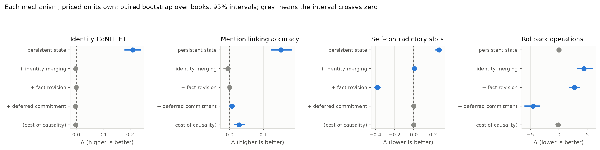
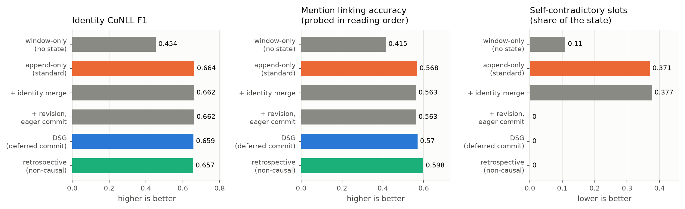
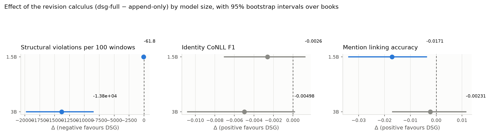
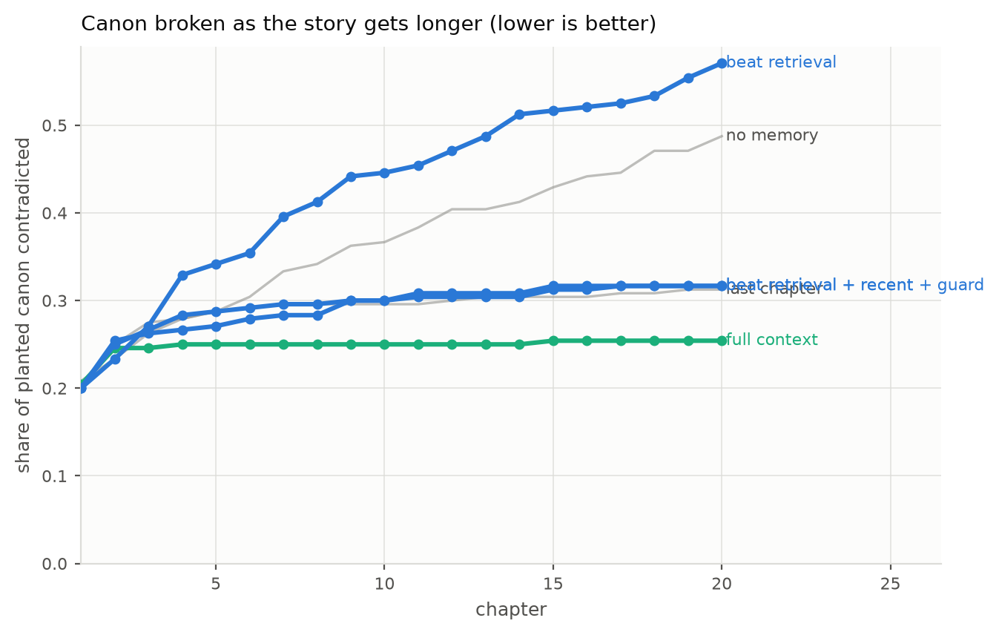
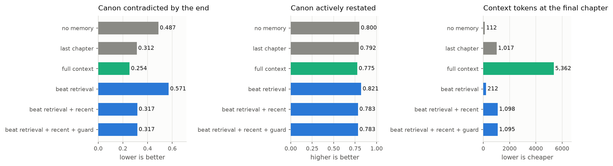
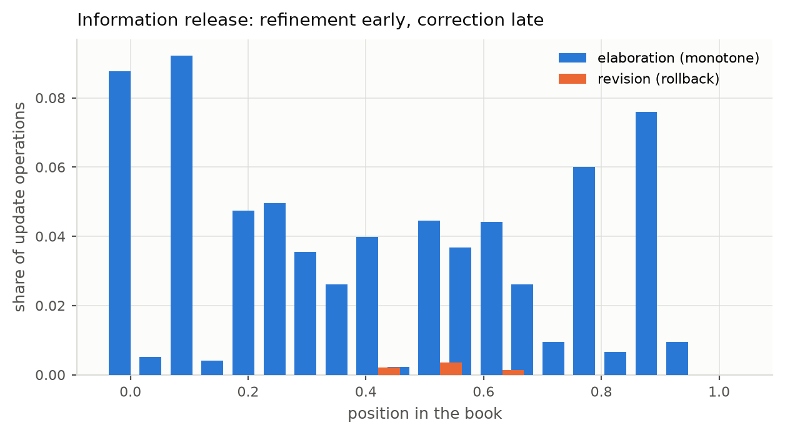

# DSG: Dynamic Story Graph

A revision aware narrative state for book length fiction, and a study of what
such a state is actually good for.

Every number on this page comes from a generated report under
`artifacts/report/`. Nothing is typed by hand. No large language model appears
in any metric.

```bash
python -m dsg doctor                  # environment and corpus check
python -m pytest tests/dsg -q         # 158 tests, no weights, no network
```

## Contents

1. [What this is](#1-what-this-is)
2. [The revision calculus](#2-the-revision-calculus)
3. [Result one: maintaining a state](#3-result-one-maintaining-a-state)
4. [Result two: writing with a state](#4-result-two-writing-with-a-state)
5. [Result three: measuring a text](#5-result-three-measuring-a-text)
6. [The benchmark](#6-the-benchmark)
7. [Architecture](#7-architecture)
8. [Reproducing](#8-reproducing)
9. [Artifacts](#9-artifacts)
10. [Limitations](#10-limitations)

## 1. What this is

A reader builds a model of a novel as the novel arrives. At any point they know
only what they have been told. Fiction is written for that constraint and
exploits it: identity is withheld and later disclosed, beliefs are planted and
later corrected, and the world changes while what was true earlier stays true of
its moment.

Automatic narrative extraction usually ignores the constraint and reads the
finished text with full access to the ending. This project builds the state
forward instead, under a strict prefix causal rule, and then asks three
questions.

| question | answer | evidence |
|---|---|---|
| Can a maintained state stay coherent as a book proceeds? | Yes, and the update rules are what make it so | 28 novels, 3 extractor sizes |
| Does that state help a model write a long story? | No, in five separate designs | 18,600 generated chapters |
| Does its contradiction count measure how consistent a text is? | No, it measures the extractor | 215 novels vs 30 stories |

The second and third answers are negative. They are reported because they bound
what the first answer may claim.

## 2. The revision calculus

Three update types that append only pipelines conflate.

| operation | fires when | effect on the earlier belief |
|---|---|---|
| `ELABORATE` | later text specifies what earlier text left open | refined in place, nothing retracted |
| `SUPERSEDE` | the story world changed | validity interval closed, kept as history |
| `REVISE` | the reader was wrong, it was never true | retracted, and so is anything derived from it |

The split between `SUPERSEDE` and `REVISE` is the operational form of a
narratological distinction, an event in the story versus a disclosure in the
telling. It is decided by an inspectable table in `dsg/lexicon.py`, covering
predicate mutability, evidential source and surface revelation markers. A
language model never makes that call.

Each assertion carries two clocks. Discourse time records while the reader held
the belief. Story time records while the fact held in the world. A reveal moves
the first without moving the second; a plot event moves the second.

Seven structural invariants are checked after every reading step, including
prefix causality: no assertion may cite text the reader has not reached.

## 3. Result one: maintaining a state

Given a fixed stream of extracted assertions, an append only store turns a large
share of its own slots self contradictory. A store with the full calculus reports
none.

| corpus and extractor | documents | append only | DSG |
|---|---|---|---|
| PDNC, Qwen2.5 7B | 28 novels | **0.371** | 0.000 |
| PDNC, Qwen2.5 3B | 28 novels | **0.423** | 0.000 |
| PDNC, Qwen2.5 1.5B | 28 novels | **0.107** | 0.000 |
| LitBank, Qwen2.5 7B | 100 excerpts | **0.181** | 0.000 |

Share of single valued slots holding two or more live conflicting values. Lower
is better.

**The empirical column is the left one.** Invariant I1 is defined as two live
conflicting values in one single valued slot, and `_close_and_link` in
`dsg/store.py` closes every conflicting assertion before adding a new one, so
I1 = 0 is a postcondition the calculus enforces by construction. It holds on all
184 book runs, which is what a guarantee looks like rather than what a
measurement looks like. The 0.000 column is a conformance check and is reported
as one.

What is measured, and was not obvious in advance, is that enforcing consistency
costs nothing: the accuracy metrics do not move across the revision rung. The
natural worry is that aggressive revision discards correct facts, and it does
not.

Each rung of the policy ladder adds exactly one mechanism, so each is priced on
its own. Every policy replays a byte identical cached proposal stream, so
differences are attributable to the representation and never to extractor
variance.



Reading the panels: persistent state buys a large amount of accuracy and at the
same time introduces contradiction. Fact revision removes that contradiction on
every book at no accuracy cost. Deferred commitment converts rollbacks into
monotone updates. Grey means the interval crosses zero.



The effect holds across extractor sizes.



**Scope.** This is a claim about representations given identical input. It is
established by holding extraction constant and varying only the update policy.
It is not a claim that the resulting state is a faithful model of the text. See
section 5.

**What identity accuracy does not show.** A pre registered falsifier fired here.
The calculus does not improve identity accuracy at any model size, for example
CoNLL F1 of 0.659 against 0.664 at 7B. What it buys is consistency, not
accuracy, and the write up says so.

## 4. Result two: writing with a state

Five ways of using the graph at generation time, four runs, 18,600 chapters,
30 stories, conditions paired within story.

Five ways of using the graph at generation time were tested. None helps.

| use of the graph | violations | prompt tokens | verdict |
|---|---|---|---|
| none, no memory at all | 0.487 | 112 | floor |
| previous chapter, no graph | 0.312 to 0.354 | 1,017 | memory baseline |
| full transcript, no graph | 0.254 to 0.400 | 5,362 | memory baseline, unstable |
| carried: serialised state digest | 0.588 | 357 | worse than nothing |
| carried plus recent text | 0.379 | 1,194 | loses to recent text alone |
| queried: beat conditioned retrieval | 0.571 | 212 | worse than nothing |
| queried plus recent text | 0.317 | 1,098 | ties recent text alone |
| used to rank four candidates | 0.300 | 1,017 | ties choosing blind |

Paired bootstrap over stories, 95 percent intervals.

| comparison | difference | interval | excludes zero |
|---|---|---|---|
| serialised digest minus none | +0.083 | [+0.025, +0.142] | yes |
| beat retrieval minus none | +0.083 | [+0.038, +0.125] | yes |
| retrieval plus previous minus previous alone | +0.004 | [-0.042, +0.050] | no |
| guard minus no guard | +0.000 | [-0.033, +0.038] | no |
| **graph ranking minus choosing blind** | **+0.004** | [-0.058, +0.063] | **no** |

The last row is the one the project's own negatives predicted should succeed.
Absolute contradiction counts are extractor dominated, relative comparisons on
identical input are sound, and ranking candidates for one chapter position is
the relative case. It still does not work, and the blind arm is what shows it:
without that control the result reads as a 0.054 gain that in fact belongs to
drawing four samples.





Three things follow.

**This is not an extraction ceiling.** The state held 0.492 of the planted canon
at the moment of writing, half of it correctly, and conditioning on it still
added nothing. Improving extraction would not have rescued the result.

**It replicates a published negative.** The Narrative World Model paper reports
serialised current state at 0.358 against query conditioned retrieval at 0.898.
Our serialised digest is structurally their State Memory condition. We reproduce
their failure with a 3B open model, and find that their success condition does
not transfer.

**One baseline ordering is not established, and an earlier claim here is
withdrawn.** Across three runs the full transcript condition moves from 0.254 to
0.400, a spread of 0.146 that is larger than almost every effect in this
project. Its ranking against the previous chapter is unresolved at this sample
size. What survives the variance is that no memory is clearly worst, and that
every graph design lands at or below the memory baselines rather than above
them. Conditions whose prompt grows without bound need several seeds before
effects below roughly 0.15 are reported.

### A false positive caught

Run one also included a LoRA fine tuned on 6,876 state conditioned examples. It
scored 0.054 against 0.367 for the base model, an apparent seven fold win. It
was not real. The model had degenerated into pastiche of its training corpus,
reproducing even the hard wrap indentation of Project Gutenberg, and a model
that stops writing about the premise cannot violate its canon.

| | base conditions | tuned conditions |
|---|---|---|
| chapters mentioning any premise character | 1.000 | 0.765 to 0.812 |
| canon facts actively restated | 0.838 to 0.887 | 0.092 to 0.163 |

`on_premise` is now a first class metric so this cannot be reported as a win
again. The tuned arm is excluded from every conclusion.

## 5. Result three: measuring a text

We tested the instrument's external validity and it failed. The test is reported
because it constrains section 3.

**Design.** 215 published novels and 30 generated stories, first 20 chapters
each, read with the same extraction prompt, the same reconciler and the same
policy. If the contradiction rate measures textual consistency, professionally
edited novels should score far below machine generated ones.

| population | documents | mean rate | median |
|---|---|---|---|
| published novels | 215 | 0.238 | 0.236 |
| generated stories | 30 | 0.212 | 0.167 |

**AUC 0.394, 95 percent interval [0.259, 0.534].** The interval spans chance.
Published novels score 0.238, which is not a credible rate of genuine self
contradiction in edited prose.

**Diagnosis.** The flagged conflicts in real novels are extraction artefacts. In
Peter Pan: `Mrs. Darling.occupation: [wife, mother]`, both true;
`Nana.material: [Newfoundland dog, dog]`, one thing at two precisions;
`Wendy.resides_in: [14, nursery]`, a house number and a room.

**Correction applied.** `occupation` is genuinely multi valued and was
reclassified. Refinement detection was broadened so a more precise restatement
is not treated as a rival value. Both populations dropped, human from 0.267 to
0.238, and they still did not separate. Residual extraction noise dominates the
absolute level.

**What this licenses.** Section 3 stands, because it compares policies on
identical input and a shared noise floor cancels. What is forbidden is reporting
the contradiction rate as a measure of how consistent a text is, and we do not.

## 6. The benchmark

Generated stories have no gold. Human judgement is expensive and a language
model judge is the thing being avoided. So the gold is planted.

Each premise fixes canon facts drawn from closed vocabularies whose
contradictions are enumerable: eye colour, metal, kinship, trade, birthplace. A
violation is a deterministic string test near a mention of its subject. A nearby
correction, for example "not gold but silver", is correctly not counted.

Canon is stated in chapter 1 and withheld from chapter 2 onward, so the
benchmark tests memory rather than prompt following.

Two properties make it durable. It is gold by construction, so unlike section 5
it does not depend on extraction quality at all. And it ships with
`on_premise`, the denominator that exposes the degenerate model artefact above.

The revision trace also yields a descriptive view of where a reader's model is
refined against where it is corrected.



Reported with a shuffled window control, because state growth alone manufactures
such trends. Under shuffling the elaboration trend disappears, so it is a
property of narrative order, while most of the revision trend survives, so it is
largely an artefact of the state getting larger.

## 7. Architecture

```
                 prefix causal boundary: at step t the system may read
                 window t and state from windows before t, nothing later

  text ──> windows ──> LLM PROPOSES ──> RECONCILER DISPOSES ──> STATE
              ^         typed lines      classify, resolve        entities
              |         never writes     apply the calculus       assertions
              |                          check 7 invariants       revision log
              └───────── next window ────────────┘
```

The language model has no write access. It emits proposals; a deterministic
reconciler classifies each one, resolves identity, applies the calculus and
enforces the invariants. Two consequences matter: the reasoning under test is
not a black box, and extraction can be cached and replayed so every policy sees
a byte identical stream.

| module | responsibility |
|---|---|
| `schemas.py` | assertions with two clocks, discourse time and story time |
| `lexicon.py` | predicate mutability, revelation markers, closed ranges |
| `matching.py` | conservative surface matching, title aware |
| `store.py` | the calculus, the policy ladder, the revision log |
| `invariants.py` | seven structural checks plus the bounded slot rate |
| `proposals.py` | prompt, tolerant line parser, policy free digest |
| `policies/runner.py` | replays one cached stream under any policy |
| `generate/` | planted canon, memory conditions, the graph guard |
| `eval/` | identity, mention probes, speaker, process, discrimination |
| `infra/` | Modal apps for extraction, dataset building, training, generation |

**Title aware matching.** In this corpus "Mr. Bennet", "Mrs. Bennet" and "Miss
Bennet" are three people who share a surname. Comparing surfaces with the
honorific stripped collapsed a household into one node, and 74 gold characters
in Pride and Prejudice into three. Titles are now distinguishing.

**The merge constraint.** An identity link may bind an unnamed reference to a
named character, or link two surface compatible names. It may not assert that
two separately named characters are one person, because a single bad link fuses
two people and the fused node then attracts more. This was adopted after
measurement: across 205 links on one novel, repetition did not separate good
from bad, since `Mr. Darcy -> Elizabeth` was proposed nine times, as often as
the correct `Mr. Bingley -> Bingley`.

## 8. Reproducing

The GPU stage runs once per corpus and model. Everything downstream is
deterministic CPU work over cached proposals, so the whole study re scores for
free after a change to the calculus.

```bash
# reading study
modal run dsg/infra/modal_extract.py::main --corpus pdnc --model qwen7b
python -m dsg study  --corpus pdnc --proposals artifacts/proposals/pdnc-qwen7b-w3200 \
                     --out artifacts/results/pdnc-qwen7b
python -m dsg report --results artifacts/results/pdnc-qwen7b --out artifacts/report/pdnc-qwen7b

# generation study
scripts/run_pipeline.sh                 # dataset, LoRA, generation, report
STAGE=generate scripts/run_pipeline.sh  # one stage

# operating on an unreliable connection
scripts/modal_control.sh status | stop | fetch
```

Jobs are deliberately not detached. Losing the client kills the container, which
stops the billing. That is only safe because every stage checkpoints as it goes,
the dataset build every two chapters, the trainer every 50 steps, generation
after every chapter, and re running the same run id resumes. `scripts/supervise.sh`
waits for the network to return and retries, so progress accumulates across
drops.

`--backend mock` runs the entire pipeline with no weights and no network, which
is what continuous integration exercises.

## 9. Artifacts

| artifact | location |
|---|---|
| training dataset, 6,876 examples from 215 novels | `GOVINDFROM/dsg-state-continuation` |
| LoRA adapter, validation loss 2.7182 to 2.5439 | `GOVINDFROM/dsg-writer-qwen3b` |
| results, figures, raw generations, extraction proposals | `GOVINDFROM/dsg-artifacts` |

Corpora are fetched from source and never redistributed here.

| corpus | supplies | source |
|---|---|---|
| PDNC, 28 novels | full text, gold alias sets, 37,131 gold quotations with speakers | Priya22/project-dialogism-novel-corpus |
| LitBank, 100 excerpts | gold coreference, short context control | dbamman/litbank |
| Project Gutenberg, 215 novels | training corpus for the writer | sedthh/gutenberg_english |

## 10. Limitations

**Extraction is the binding constraint everywhere.** Capture by canon type at
chapter 20: eye colour 0.50, trade 0.38, hair 0.33, birthplace 0.23, object
material 0.12. The extractor is character centric and largely ignores objects.

**Identity gold is alias level.** PDNC alias sets are surface strings, not full
mention level coreference. The mention linking probe partly compensates but
covers only referring expressions inside quotations.

**We are not competitive with supervised coreference and do not claim to be.**
That line reaches roughly 81 CoNLL F1 on LitBank with supervised systems scored
on mention clusters. Our identity plane is unsupervised and scored on a
different item set. The numbers are not comparable.

**The generation premises are synthetic.** That is the price of controlled gold.
The method transfers to any premise with checkable attributes.

**One model family.** Everything is Qwen2.5. A second family would establish
that the negatives are not family specific.

**The `SUPERSEDE` versus `REVISE` decision is itself unevaluated.** It is the
conceptual centre and the least tested part. A few hundred hand annotated
conflict pairs would settle it.

**Nicknames are unrecoverable** under the merge constraint. "Lizzy" and
"Elizabeth" share no surface material, so the guard that correctly blocks
"Jane to Elizabeth" also blocks the correct "Lizzy to Elizabeth".
