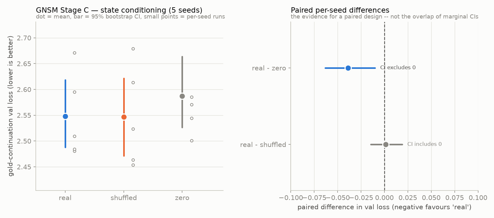

# Stage C: graph-state-conditioned generation — measured results

**Headline: the primary hypothesis was not supported.** Conditioning a frozen
LM on GNSM's learned narrative state gave *no* measurable advantage over
conditioning on a deliberately mismatched state. A secondary contrast did
reach significance, and it points at where the pipeline is actually failing.

Every number below was read from
[`figures/adapter-experiment-v2-summary.json`](figures/adapter-experiment-v2-summary.json),
the raw output of one real run — reproduce with:

```bash
modal run gnsm/infra/modal_app.py::experiment \
  --seeds 0,1,2,3,4 --conditions real,shuffled,zero \
  --epochs 12 --batch-size 16 --patience 3 --lr 1e-4 --max-target-tokens 64 \
  --gpu t4 --hf-repo GOVINDFROM/DNG-GNSM \
  --encoder-run-id evolvtrip-v2-earlystop --run-id adapter-experiment-v2
```

## Setup

| Item | Value | Source |
|---|---|---|
| Frozen state encoder | `GraphStateEncoder`, hidden_dim 128, input_dim 64, 2 layers, 4 heads | geometry read from checkpoint tensor `input_projection.weight` = [128, 64] |
| Encoder checkpoint | run `evolvtrip-v2-earlystop`, step 350, val_loss 3.7930 | `best.json` in `GOVINDFROM/DNG-GNSM` |
| Frozen LM | `Qwen/Qwen2.5-0.5B-Instruct`, hidden_size 896 | `model.config.hidden_size`, read at runtime |
| Trainable adapter | `StatePrefixAdapter`, 8 prefix tokens, 13,083,392 params | trainer output |
| Frozen params | 494,439,680 (LM + encoder) | trainer output |
| Data | EvolvTrip, 428 (book, character, t→t+1) examples | `load_examples` |
| Budget | 12 epochs, batch 16, lr 1e-4, 64 target tokens, 5 seeds × 3 conditions | run config |
| Compute | Modal T4, 5444.5 s wall clock (~6 min/run × 15) | run output |

Method: prefix tuning (Li & Liang 2021; Lester et al. 2021). The adapter maps
the frozen encoder's `global_state` to 8 soft-prompt embeddings prepended to
the gold next-scene token embeddings via `inputs_embeds`. Cross-entropy on the
gold continuation only; prefix positions and padding masked to -100 (verified
in `tests/test_train_adapter.py`).

Conditions — each trains its own adapter from scratch on the same split/seed:
- **real** — the example's own state (treatment)
- **shuffled** — another example's state; same distribution, correspondence
  destroyed (isolates *example-specific* information)
- **zero** — a zero vector, so the adapter emits an *identical* prefix for
  every example (isolates *having a varying prefix at all*)

## Results



| Condition | Mean val loss | 95% bootstrap CI | Per-seed values |
|---|---|---|---|
| real | 2.5481 | [2.4878, 2.6185] | 2.4805, 2.5094, 2.6711, 2.4843, 2.5950 |
| shuffled | 2.5466 | [2.4716, 2.6216] | 2.4633, 2.5232, 2.6790, 2.4540, 2.6133 |
| zero | 2.5871 | [2.5263, 2.6637] | 2.5441, 2.5709, 2.7345, 2.5008, 2.5851 |

Paired per-seed comparisons (negative favours `real`; lower loss is better):

| Comparison | Mean Δ | 95% CI | Excludes 0? | real wins | sign-test p |
|---|---|---|---|---|---|
| real − shuffled | **+0.0015** | [−0.0144, +0.0189] | **No** | 3/5 | 1.0 |
| real − zero | **−0.0390** | [−0.0631, −0.0101] | **Yes** | 4/5 | 0.375 |

### What this shows

1. **`real` vs `shuffled`: no effect.** The mean difference (+0.0015) is
   *toward the control*, the CI comfortably spans zero, and the win split is
   3–2. Against ~0.083 of seed-level spread this is indistinguishable from
   noise. The learned narrative state is **not** contributing example-specific
   information the LM can use.
2. **`real` vs `zero`: a real effect (Δ −0.039, CI excludes 0).** But note
   what separates these two conditions: `zero` feeds a constant vector, so its
   adapter emits the *same* prefix for every example. `shuffled` still emits a
   *varying* prefix — just a mismatched one. Since shuffled ≈ real ≫ zero, the
   benefit comes from the prefix **varying across examples**, not from the
   state being *correct*. The adapter is exploiting distributional properties
   of the state space, not narrative content.

### Qualitative corroboration

[`figures/sample_generations.json`](figures/sample_generations.json) holds real
continuations. They match EvolvTrip's *register* but invent generic settings:

| Gold | Generated |
|---|---|
| "a violent, apocalyptic storm on a desolate heath" | "In a dimly lit room, the setting is tense and foreboding" |
| "a wild and desolate heath, enveloped by a raging storm" | "the heart of London, a bustling urban environment" |
| "the British camp, a tense and charged atmosphere" | "a small, secluded village outside the city walls" |

Style transferred; scene-specific content did not — exactly what the null
predicts.

## Why the sign test is not the headline

At 5 seeds an exact two-sided sign test cannot return a p below 2/2⁵ =
**0.0625**, so it can never clear 0.05 no matter how consistent the effect
(`sign_test_p_floor` is reported in the JSON for this reason, and
`tests/test_stats.py::test_paired_bootstrap_beats_the_sign_test_p_floor_at_n_five`
demonstrates it). The paired bootstrap CI is the usable evidence here. Note
also that the **marginal CIs in the left panel overlap heavily even for
real-vs-zero** — in a paired design, seed variance is shared and cancels in
the difference, so overlapping marginal CIs do not imply a null. The right
panel is the correct thing to read.

## Limitations — read before citing anything above

1. **Not converged.** All 15 runs finished with `early_stopped=False` at the
   full 12-epoch budget, i.e. val loss was still improving. Comparisons are
   fair (identical budget) but these are not converged results.
2. **0.5B model.** Chosen for in-session verifiability. The project's catalog
   targets Qwen2.5-7B/14B; conclusions may not transfer.
3. **A weak encoder.** The frozen encoder was trained on 428 examples to
   val_loss 3.79. If the state itself carries little information, Stage C
   cannot recover it — this is the most likely explanation for the null and
   the first thing to fix.
4. **One dataset, 428 examples, 5 seeds.**
5. **No consistency metric — and here is why.** Running
   `gnsm/eval/extraction_coverage.py` over 100 real EvolvTrip texts gives
   mean_entities 7.0, mean_edges 0.26, **mean_attributes 0.0**, mean_quotes
   0.01; edges in 16/100 texts, attributes in **0/100**
   ([raw](figures/extraction-coverage-evolvtrip.json)). Every
   `ConsistencyVerifier` check depends on attributes, LOCATED_AT edges, or a
   predicted delta, so it would report zero violations regardless of model
   output. A vacuous perfect score is worse than no score.
6. **No LLM-judge metrics** (contradiction, ConStory-Bench, FABLES) — no API
   key available.
7. **No Neo4j-dependent baselines** — `manuscript-memory-engine/baselines/*`
   and `long_context.py` need a live graph DB.
8. **No human evaluation.**
9. **Loss, not story quality.** Gold-continuation loss measures next-scene
   predictability, not narrative consistency or readability.

## What this does and does not license claiming

**Supported:** Stage C is implemented and runs end to end — a learned
narrative state conditions a frozen LM through a trained soft prefix, and a
*varying* prefix measurably beats a constant one (Δ −0.039, CI excludes 0).

**Not supported:** that GNSM's narrative state improves generation. On the
controlled comparison that tests exactly that, the effect is zero.

**Most informative next steps**, in the order I'd take them:
1. Train the encoder on PDNC (~36K examples, best val loss 1.90) instead of
   EvolvTrip (428 examples, val loss 3.79) and re-run this identical
   experiment — the cheapest test of the "weak encoder" hypothesis, and all
   the machinery already exists.
2. Train to convergence (raise `--epochs` until early stopping actually fires).
3. Add seeds — ≥6 makes the sign test capable of clearing 0.05.
4. Only then scale to a larger LM; scaling before the state carries signal
   would just be more expensive noise.
